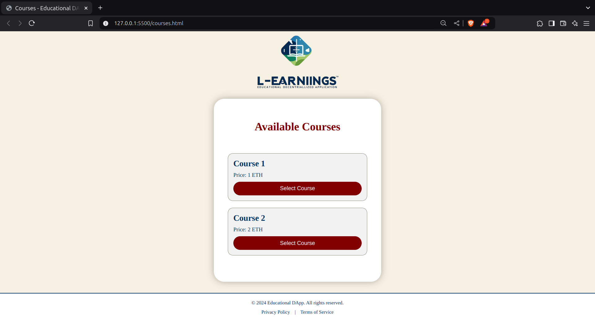

# **L-earnings DApp**

Welcome to **L-earnings**! This decentralized application enables users to request and receive refunds based on their quiz performance in an educational system. Built on Ethereum, **L-earnings** ensures transparency and security in managing refunds through smart contracts.

---

## **Features**

### Frontend
- **Elegant UI**: User-friendly and responsive interface.
- **Wallet Integration**: Seamless MetaMask integration for blockchain interaction.
- **Dynamic Feedback**: Display of refund percentages based on user scores.

### Smart Contract
- **Secure Fund Management**: Handles deposits, refund requests, and processing securely.
- **Owner-Managed Refunds**: Only the contract owner can process refund requests.
- **Balance Transparency**: View the contract's available funds for user confidence.

---

## **Technologies Used**

### **Frontend**
- **HTML**, **CSS**, and **JavaScript**
- **Web3.js** and **Ethers.js** for Ethereum blockchain interaction.
- MetaMask for wallet connectivity.

### **Smart Contract**
- **Solidity**: Ethereum smart contract development.

### **Testing**
- **Truffle Suite**: For contract compilation, deployment, and testing.

---

## **How It Works**

### 1. **Deposit Funds**
   - The contract owner or any user can deposit funds into the smart contract.

### 2. **Refund Request**
   - Users can enter their wallet address and request a refund based on their quiz performance.
   - Refund amounts are calculated as a percentage of the course fee.

### 3. **Refund Processing**
   - The owner reviews and processes refund requests.
   - The contract ensures sufficient funds before approving transfers.

### 4. **Transparency**
   - Users can view the contract balance to ensure accountability.

---

## **Smart Contract Details**

### Key Functions

| Function           | Description                                                                 |
|--------------------|-----------------------------------------------------------------------------|
| `deposit()`        | Allows users to deposit funds into the contract.                           |
| `requestRefund()`  | Users can request a refund by specifying an amount.                        |
| `processRefund()`  | Allows the owner to process a refund for a specific user.                  |
| `getContractBalance()` | Returns the current balance of the contract.                            |

---
## Prerequisites

To run, test, and deploy the **L-earnings** DApp, ensure you have the following prerequisites installed and configured:


#### **1. Node.js**  
   - Download and install Node.js from [Node.js official website](https://nodejs.org/).  
   - Verify installation by running:  
     ```bash
     node -v
     npm -v
     ```


#### **2. Truffle Suite** (for smart contract development and testing)  
   - Install Truffle globally using npm:  
     ```bash
     npm install -g truffle
     ```
   - Verify installation:  
     ```bash
     truffle version
     ```
   - Truffle is used for:  
     - Compiling Solidity contracts.  
     - Deploying contracts to a blockchain network.  
     - Running automated tests.


#### **3. Ganache** (Local Ethereum Blockchain for testing)  
   - Download and install Ganache from [Ganache official website](https://trufflesuite.com/ganache/).  
   - Alternatively, install it via npm:  
     ```bash
     npm install -g ganache
     ```
   - Ganache simulates a blockchain network, providing accounts preloaded with test ETH for smart contract interactions.


#### **4. MetaMask**  
   - Install the MetaMask browser extension for interacting with the Ethereum blockchain.  
   - Set up a wallet and connect it to the Ganache network (for local testing) or a testnet.


#### **5. Web3.js** (for blockchain interaction in the frontend)  
   - Web3.js is included via a CDN in the project files. Ensure you have internet access when running the application.


#### **6. Ethers.js** (optional, for additional blockchain utilities)  
   - Ethers.js is also included via a CDN in the project files.


#### **7. Solidity**  
   - Solidity is the smart contract language used in this project. Truffle automatically compiles Solidity code.


#### **8. Code Editor**  
   - Use a code editor such as [Visual Studio Code (VS Code)](https://code.visualstudio.com/) for managing project files and writing code.


#### **9. Ethereum Wallet with Test ETH**  
   - Use MetaMask to manage your wallet. For testing, you can obtain test ETH from faucets (if using a public test network).


#### **10. Testing with Truffle**  
   - Truffle is also used for writing and executing tests for smart contracts.
   - Test the contracts with the following commands:
     ```bash
     truffle test
     ```
   - Ensure all tests pass before deployment.


These prerequisites will prepare you for a seamless experience in developing, testing, and deploying the **L-earnings** DApp.

---

## How to Run Locally

Follow these steps to run the **L-earnings** project locally on your machine:


#### **1. Set Up Ganache**  
   Start a local blockchain using Ganache CLI:  
   ```bash
   ganache-cli --port 8545 --networkId 1337
   ```  
   This simulates an Ethereum blockchain locally.


#### **2. Open Project Folder**  
   Open the main project folder in your terminal.


#### **3. Initialize Truffle**  
   Initialize Truffle in the project directory:  
   ```bash
   truffle init
   ```


#### **4. Compile Smart Contracts**  
   Compile the smart contract using Truffle:  
   ```bash
   truffle compile
   ```


#### **5. Set Up Truffle Configuration**  
   Edit the `truffle-config.js` file to include the local Ganache network configuration. Use the following settings:  
   ```javascript
   networks: {
       development: {
           host: "127.0.0.1", // Localhost
           port: 8545,        // Ganache default port
           network_id: "1337" // Match Ganache's network ID
       }
   }
   ```


#### **6. Test the Smart Contract**  
   Run the tests for the smart contract to ensure everything works as expected:  
   ```bash
   truffle test
   ```  
   All tests should pass.


#### **7. Deploy the Smart Contract**  
   Deploy the smart contract to the local Ganache blockchain:  
   ```bash
   truffle migrate
   ```  
   Copy the deployed contract's **address** from the terminal.


#### **8. Update Refund Page with Contract Details**  
   - **Contract Address:**  
     Paste the contract address from the terminal into the `refund` page's script.  
   - **Contract ABI:**  
     Replace the ABI in the JSON file of the frontend (`refund` page) with the ABI generated by Truffle.


#### **9. Set Up MetaMask**  
   - Install the MetaMask browser extension.  
   - Configure MetaMask to connect to the local Ganache network:  
     1. Open MetaMask settings.  
     2. Add a new network with the following details:  
        - **Network Name:** Ganache Local  
        - **New RPC URL:** `http://127.0.0.1:8545`  
        - **Chain ID:** 1337  
     3. Import one of the private keys from Ganache into MetaMask.


#### **10. Deploy Website Login Page**  
   - Use a local web server to host the project files.  
   - For example, using Python's built-in server:  
     ```bash
     python -m http.server
     ```  
   - Open your browser and navigate to `http://127.0.0.1:8000`.

You should now have the **L-earnings** DApp running locally, fully integrated with your smart contract! 
---

## **Screenshots**

## Login Page


## Courses Selection Page


## Buying Page


## Courses Page


## Quiz Page


### Refund Page


---

## **Roadmap**

### Planned Enhancements:
- **Automated Refunds**: Enable automatic processing of refunds based on predefined rules.
- **Multi-Network Support**: Add compatibility for other blockchains like Polygon and Binance Smart Chain.
- **Enhanced User Analytics**: Provide detailed user performance reports within the app.
- **Gas Optimization**: Refactor smart contracts for reduced transaction costs.

---

## **Contributing**

We welcome contributions to improve **L-earnings**! Here's how you can contribute:
1. Fork the repository.
2. Create a feature branch:
   ```bash
   git checkout -b feature-name
   ```
3. Commit and push your changes.
4. Open a pull request for review.

---

## **License**

This project is licensed under the MIT License. See the [LICENSE](LICENSE) file for more details.

---

## **Contact**

For any queries, suggestions, or feedback:
- **Email**: rishabraj182003@gmail.com


---

Thank you for choosing **L-earnings**! 🚀 Empowering education, one refund at a time. 
